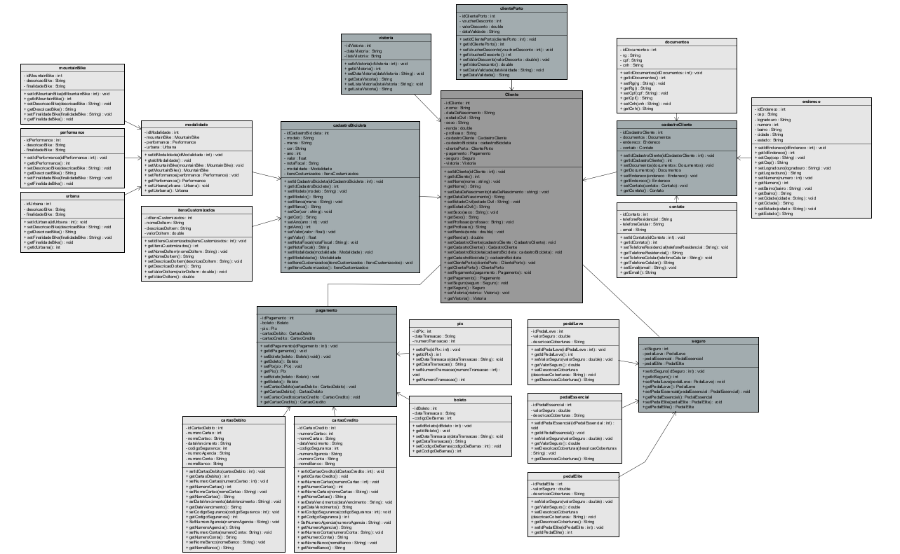

# Sprint4-JAVA
Projeto full stack - API Restful
(JAVA do projeto vencedor do Next 2023 - Challenge Digital Innovation - Parceria da empresa Porto com a FIAP)
Projeto completo contem: Além do Java, o Front foi codado em react com next.js e styled components, IA codada e treinada no TensorFlow e Teachable Machine, banco de dados em Oracle SQL, utilizamos paralelamente no front um sistema a parte codado em Python.
Camadas implementadas:
- beans
- main
- excecoes
- conexoes
- dao
- model
- services
- bo
- resources

